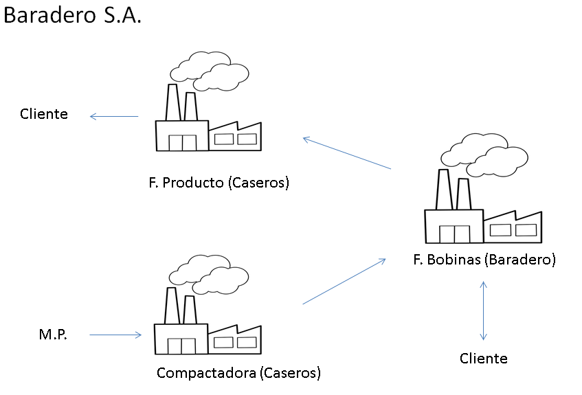
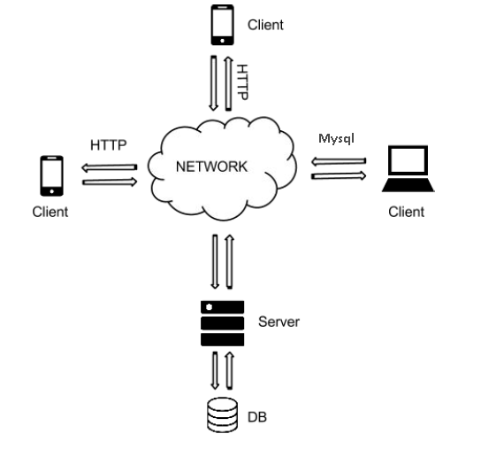

======================
Documentación técnica
======================

************************************
Relevamiento empresa
************************************

La papelera de reciclaje cuenta con tres plantas recicladoras:

1. La primer planta recicladora se encuentra situada en Caseros y será la que recibirá la materia prima a reciclar. La misma se encargará de compactarla y luego de enviarla a la siguiente planta.
2. Esta planta se encuentra situada en Baradero y la misma se encarga de procesar la materia prima para sacar las bobinas de papel. Luego esas bobinas podrán quedarse como stock en esta planta, ser vendidas directamente a un cliente o ser despachadas a la tercer planta recicladora para que queden como stock allí.
Proyecto de Trabajo Profesional
2
3. Esta planta también se ubica en Caseros y recibe bobinas de papel proveniente de la planta de Baradero. Las mismas pueden quedar como stock y luego ser vendidas directamente a un cliente o también desarrollar papel higiénico.
Nuestro sistema a plantear se situará en las plantas 2 y 3. Primeramente se pondrán 2 servidores en paralelo. Uno se lo instalara en la planta 2 y el otro en la 3 ya que los registros de la planta 2 son independientes de la planta 3. Esta forma de almacenar los datos se planteo por el hecho de que la planta de Baradero sufre frecuentes cortes de internet y si no se hiciera de esta manera seria imposible el trabajo continuo.
En la planta 2 se ubicará el Sistema de formulario para obreros el cual es el principal y único ingreso de bobinas al sistema. La forma que se ingresaran las bobinas a la planta 3 será mediante la Aplicación de celular para el escaneo y control de las bobinas.
Para el control de las bases de datos se armará un Sistema administrador para corroborar el stock de bobinas el cual estará instalado tanto en la planta 2 como en la 3. Desde el mismo se puede acceder a cualquier base de datos de los 2 servidores existentes.

El diagrama del sistema que se implementara es el siguiente:

El mismo cuenta con clientes, los cuales son celulares que escanean las bobinas desde cualquiera de las plantas para poder ser despachadas a cualquier cliente o mismo stock y asi poder imprimir remitos.
Tambien cuenta con un cliente que es el administrador que se ejecuta en ordenadores.
El servidor, descripto en la seccion posterior, se trata de un servidor web en este caso WAMP. El mismo se instalara para la planta de Baradero y otro en Caseros.

El diagrama de cambios de estado de los formularios es el siguiente:

.. image:: Imagenes/Diagramas/Diagrama Estado Formularios.png

************************************
Diagrama de clases
************************************

Desarrollar

************************************
Cliente
************************************

El cliente a nivel tecnico se puede separar en dos partes.

 a) El administrador y el formulario para la carga de stock para el obrero:
 
 Ambas partes estan integradas en un mismo proyecto y fueron programadas en C# en el framework de visual studio 2013.
 En la misma solucion se le ha desarrollado una libreria dinamica (.dll) que contiene casi toda la logica de ambos y tambien un proyecto en donde hay desarrollados alrededor de 120 test sobre la libreria.
 
 Para compilar y ejecutar los mismos basta con descargarse alguna version de visual studio y cargar la solucion entera(.sln) que se encuentra en /ControlSistematicoQR/Codigo#/ControlSistematicoBobinas.sln
 
 
 b) La aplicacion para el escaneo y cambio de estado para las bobinas de papel.

 La misma fue desarrollada para versiones de android superiores o iguales a 2.2.3 en el frameWork de eclipse. Para la parte del QR se adjunto un proyecto llamado Zxing el cual se lo bajo del siguiente repositorio:
 
 
 
 El mismo se ha modificado y unido integramente al proyecto de la aplicacion.

************************************
Servidor
************************************

Como se dijo anteriormente en este caso se ha instalado un servidor WAMP, esto quiere decir apache,mysql y php para windows. Principalmente como los servidores se ejecutan de forma local se ha configurado todo por seguridad, para que 
se rechase cualquier conexion proveniente del exterior.

En el archivo de configuracion del apache, al final de todo se debe poner lo siguiente:

 Include "c:/wamp/alias/*"
 
En la carpeta alias crear un archivo, que se puede llamar de cualquier manera con la extension .conf y agregar la siguiente informacion
 
Alias /Android/ "C:/Users/User/Desktop/Control-Sistematico-QR/ControlSistematicoBobinas/Codigo Php/"

<Directory "C:/Users/User/Desktop/Control-Sistematico-QR/ControlSistematicoBobinas/Codigo Php/">

    Options Indexes FollowSymLinks MultiViews

    AllowOverride all

    Order allow,deny

    Allow from IPLOCAL
</Directory>

En el mismo se puede ver que solo a los que pertenecen a una IPLOCAL se les deja para poder ejecutar los scripts

Obviamente el campo de IPLOCAL, se lo debe reemplazar por el campo de ip local que se tenga.

Despues el alias correspondiente para el php my admin es el siguiente:

Alias /phpmyadmin "c:/wamp/apps/phpmyadmin4.0.4/" 

# to give access to phpmyadmin from outside 
# replace the lines
#
#      Order Deny,Allow
#	Deny from all
#	Allow from 127.0.0.1
#
# by
#
#        Order Allow,Deny 
#   Allow from all
#

<Directory "c:/wamp/apps/phpmyadmin4.0.4/">
#    Options Indexes FollowSymLinks ExecCGI
#    AllowOverride all
    Order Deny,Allow
    Deny from all
    Allow from IPLOCAL
</Directory>

En el mismo se puede ver que solo a los que pertenecen a una IPLOCAL se les deja ingresar al panel para revisar de forma web la base de datos.

Obviamente el campo de IPLOCAL, se lo debe reemplazar por el campo de ip local que se tenga.

************************************
Instalador
************************************

El pack de instalacion viene conjunto a una herramienta llamada ClickOnce del visual studio 2013. El mismo se puede ejecutar y publicar desde la seccion de propiedades del proyecto de visual studio en la solapa de "Publicar".

Alli se le deben especificar los paths para el update y donde quiere que se aloje el instalador.

************************************
Base de datos
************************************

La relacion y composicion de la base de datos esta compuesta por el siguiente diagrama:

.. image:: Imagenes/Diagramas/Diagrama Relacional DB.png

La configuracion de seguridad de la misma debe ser de asignar una clave encriptada para el usuario administrador, el cual no debe tener como usuario "root". 

Se ha elegido una encriptacion de SHA1.

************************************
Repositorio
************************************

El codigo del proyecto es open source. El repositorio de todo el codigo y documentacion del proyecto se lo puede ver y descargar en el siguiente enlace:

https://github.com/JicLotus/Control-Sistematico-QR

