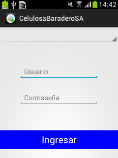
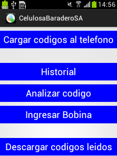
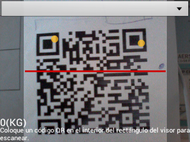
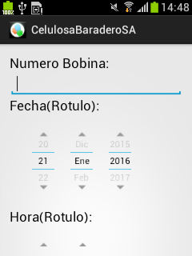
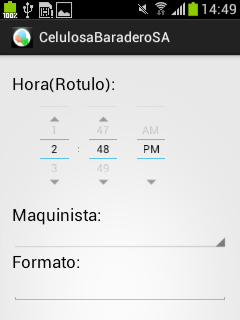
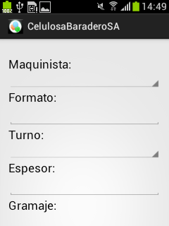
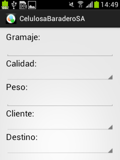
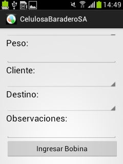

======================
Celular
======================

********************************
Ingreso de usuario
********************************

A la hora de ingresar un usuario, primero se debe seleccionar correctamente a que servidor del sistema querer ingresar. 

Para ello se ha agregado un campo selectivo, por ahora vacío ya que no está programado, en donde se puede escoger el servidor deseado.

********************************
Menú Inicial
********************************

Es el menú inicial en donde permite acceder a las diferentes opciones que posee la aplicación.

********************************
Cargar códigos de teléfono
********************************

Cuando se elige esta opción en el menú inicial aparecerá lo siguiente:

En la misma se puede escanear el QR pero primeramente se debe seleccionar el cliente al cual se quiere despachar la bobina deseada.

Mientras se realiza el escaneo se irán acumulando los pesos de las bobinas que se vayan leyendo.

********************************
Historial
********************************

Aparece el historial de las bobinas escaneadas hasta el momento. Cuando se descargan los códigos leídos el historial se vacía para luego cargar nuevas bobinas.

********************************
Analizar Código
********************************

Básicamente esta opción abre una pantalla similar a la de 'Cargar códigos al telefono' con la salvedad de que no aparece ni los clientes para despachar la bobina ni el peso total cargado, simplemente el lector.

Esto hace que podamos leer el QR y saber cuál es su contenido relacionado con la base de datos.

********************************
Descargar Códigos Leídos
********************************

Descarga todos los códigos leídos para que se les cambie su estado en la base de datos y figuren como que fueron despachados al cliente deseado. Esto permite que desde el administrador pueda imprimirse los remitos.

********************************
Ingresar Bobina
********************************

Si bien no es el método ideal para ingresar bobinas, es bastante necesario, ya que a veces por cuestiones de entorno o climáticas, puede suceder que el rotulo impreso sufra algún accidente, por lo tanto sea muy difícil la lectura del código QR. En este caso es bastante útil ingresar los datos manualmente que figuran en el rotulo impreso.

