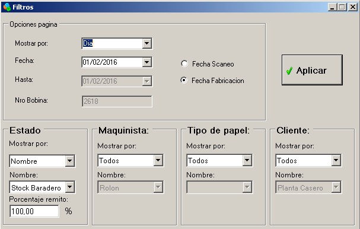
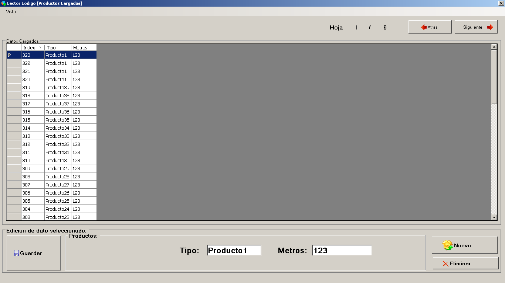

============================
Formulario del Administrador
============================

********************************
Ingreso de usuario
********************************

Aparecerá la imagen anterior para completar su usuario creado con anterioridad. Una vez ingresado el usuario y la contraseña correcta, se ingresara al sistema en donde aparecerá en la pantalla de datos cargados.

********************************
Datos Cargados
********************************

Una vez ingresado al sistema con el usuario correcto, nos aparecerá una pantalla en donde figuran datos de bobinas cargadas como la siguiente:

Las bobinas que aparecen en pantalla dependerá del último filtro que hayamos ingresado por última vez. Los filtros se almacenan y se mantienen en el sistema.

El campo de Fin_Bob en los registros de referencia que aparece, se refiere a la hora, minutos y segundos en el cual fue finalizada la bobina.

Dependiendo el privilegio se puede eliminar o modificar las bobinas que aparezcan en el registro.

Para eliminar una simplemente basta con marcarla y apretar el botón eliminar que aparece en la imagen.

Para modificar una bobina, simplemente se debe seleccionarla y modificarle los campos que aparecen y apretar el botón guardar.

Como se puede observar en la parte superior de la imagen hay tres campos importantes que son los de Estado, Peso Total y Cantidad de bobinas. 

Peso Total y Cantidad de bobinas hacen referencia a las bobinas que muestra el sistema dependiendo el filtro que se haya aplicado. Es decir, como se ve en la imagen, hay tres bobinas seleccionadas y un peso total de ellas de 1327.

El campo de Estado hace referencia en que cliente está la bobina seleccionada. Se ha marcado la primer bobina y refleja que la misma se encuentra en el Stock de Baradero.

********************************
Filtros
********************************

Para abrir el formulario de los filtros simplemente deberemos seleccionar la solapa de Filtros como se ve en la siguiente imagen:

En la misma aparecen varias opciones.

Opciones generales:

1) Fecha Escaneo/Fecha Fabricacion
	Primeramente se debe seleccionar si se quiere buscar las bobinas por la fecha en la cual fue fabricada o por la fecha en la cual se la ha escaneado con el celular
2) Mostrar Por
	En esta opción se debe seleccionar si se quiere filtrar por Dia, Mes, Año, Fecha Desde Hasta y Nro de Bobina.
3) Fecha
	Se desplegara un calendario el cual se puede seleccionar cual fecha se quiere para el filtro aplicado.
4) Hasta
	Idem a Fecha.
5) Nro Bobina
	Se debe poner el número exacto de la bobina la cual se quiere filtrar, la misma es única. Previamente para poder seleccionar este campo, se debe haber seleccionado el 'Mostrar por' como Nro de Bobina.

Opciones específicas:

	En estas opciones lo que se tiene es el hecho de seleccionar Todos o seleccionar un nombre en específico, salvo algunas excepciones. Simplemente se selecciona en 'Mostrar por' Todos o Nombre y abajo en 'Nombre' se selecciona el nombre en especifico
	
1) Estado
	Este estado tiene cierta salvedad al resto y es la que se puede seleccionar la opción de 'Excepto' en el 'Mostrar Por'.
2) Maquinista
3) Tipo de Papel
4) Cliente

Los filtros aplicados al apretar el botón de Aplicar actualizara la planilla de Datos Cargados aplicando inmediatamente los filtros. Además los filtros perduraran al cerrar la aplicación, ya que se guardan en el archivo de configuración

********************************
Imprimir
********************************

Como muestra la imagen podemos seleccionar cualquiera de las 3 opciones para imprimir directamente, Remito, Parte Diario Maquinista y Rotulo Bobina.

********************************
Remito
********************************

Como se muestra en la imagen puede llegar a saltar el error del cartel ('Error al imprimir remito. Asegúrese de tener un estado seleccionado') y es debido que en los filtros no se ha seleccionado un Estado en particular, ya que los remitos deben hacerse por Cliente.

Para corregir este error, deberemos ir al panel de filtros y en el sector de Estados, en 'Mostrar Por' seleccionar 'Nombre' y seleccionar un cliente en particular al cual se quiere hacerle el remito.

Antes de realizar el remito, deben seleccionarse las bobinas deseadas las cuales quieren ser incluidas en el mismo

También se cuenta con la opción de vista previa del remito antes de realizar la impresión

El vista previa aparece sin interfaz ya que se pretende que el remito se imprima sobre un papel con un diseño especifico

********************************
Parte Diario
********************************

En la imagen se ve la vista previa del parte diario del maquinista. Para que el mismo pueda visualizarse primeramente se debe seleccionar en Filtros, en 'Mostrar Por' 'Nombre' y seleccionar el nombre del maquinista del cual se quiere realizar su parte diario y además seleccionar por Día.

********************************
Rotulo Bobina
********************************

El rotulo bobina es el mismo que se imprime en la fábrica, con la salvedad de que el mismo sale con numero de copia 2 ya que se supone que se está imprimiendo por segunda vez como mínimo. 

En la imagen se puede observar su vista previa.

********************************
Historial Escaneo
********************************

Se pueden observar el historial de escaneo que se ha realizado con los celulares. Se puede ver que numero de bobina en específico fue despachada a un Cliente/Estado en específico. O sea que destino le dio el usuario a la bobina luego de que la haya leído con el celular.

Este sector no contiene mas opciones más que las de poder leer los registros.

********************************
Observaciones Generales
********************************

.. image:: Imagenes/Programa/Administrador/ObservacionesGenerales.png

Son todas las observaciones generales ingresadas por los obreros desde la fábrica.

Este sector no contiene mas opciones más que las de poder leer los registros.

********************************
Productos
********************************

Son los productos ingresados por la empresa. Los mismos aparecen en el formulario de los obreros en la fábrica para que puedan completar en las opciones

********************************
Maquinistas
********************************

Son los maquinistas ingresados por la empresa. Los mismos aparecen en el formulario de los obreros en la fábrica para que puedan completar en las opciones

********************************
Clientes
********************************

Son los clientes ingresados por la empresa. Los mismos aparecen en el formulario de los obreros en la fábrica para que puedan completar en las opciones y además se visualizan como opciones cuando se debe despachar una bobina con el celular

********************************
Usuarios
********************************

Son los usuarios ingresados al sistema por un administrador
