===================
Formulario operador
===================

********************************
Asignacion de maquinista
********************************

Para el comienzo de la operación de ingreso de bobinas primeramente, el maquinista que este en el turno debe seleccionar su nombre de los que está disponible en el cuadro de selección del mismo

Dicho nombre seleccionado será el que aparecerá como el que realizo la operación de dicha bobina.

La imagen del formulario es la siguiente:

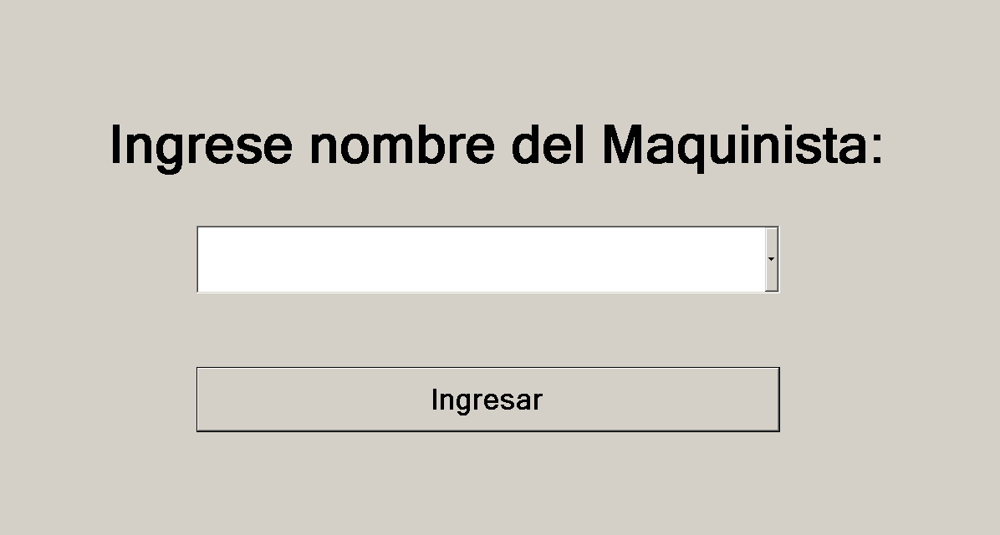

********************************
Ingreso de datos	
********************************

Una vez seleccionado el nombre del maquinista, se nos aparecerá el siguiente formulario:

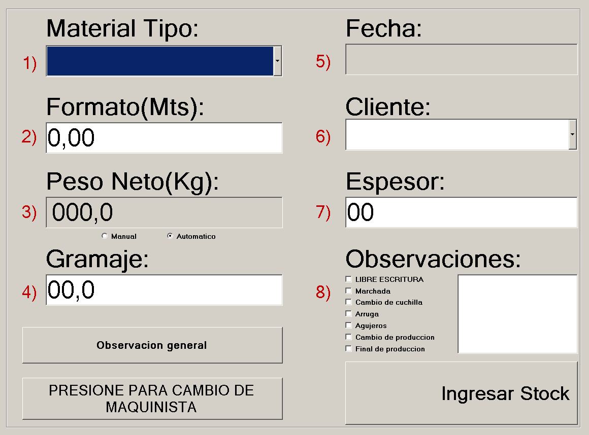

En el mismo estan las opciones de 
	1) Tipo de material
	2) Formato
	3) Peso neto
		La particularidad de este campo es que está conectado con la balanza de bobinas. En el caso de que haya una falla en el transmisor de la señal, momentáneamente se puede seleccionar el campo de manual para completar el peso indicado por el cabezal.
	4) Gramaje
	5) Fecha 
	6) Cliente 
	7) Espesor
	8) Observaciones
		Son las observaciones que el maquinista debe anotar con respecto a particularidades de la bobina que se esté registrando en ese momento.

Al hacer click en el botón de Observación general se abrirá el siguiente formulario:

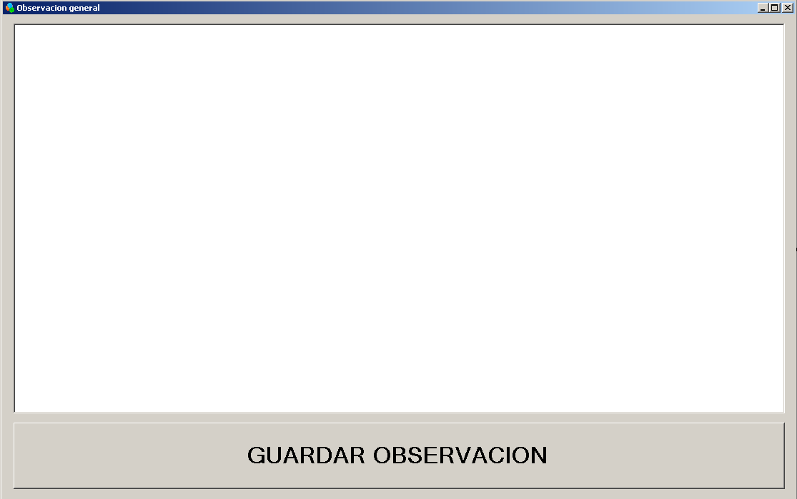

En el campo de texto se deberá anotar la observación general del día, es decir algo que que suceda que no esté directamente relacionado con la bobina en si, sino con el entorno de trabajo en general.
		
Al hacer click en el campo de cambio de maquinista simplemente se volverá a la primera selección del maquinista para que las operaciones de ingreso de bobina sean registradas a nombre de dicho maquinista.

********************************
Ver observaciones del día
********************************

Desde el mismo panel del operador, el administrador puede acceder fácilmente a las observaciones que se realizaron en el día hasta ese momento.

Para desplegar ese formulario con las observaciones del día basta con presionar la tecla F12

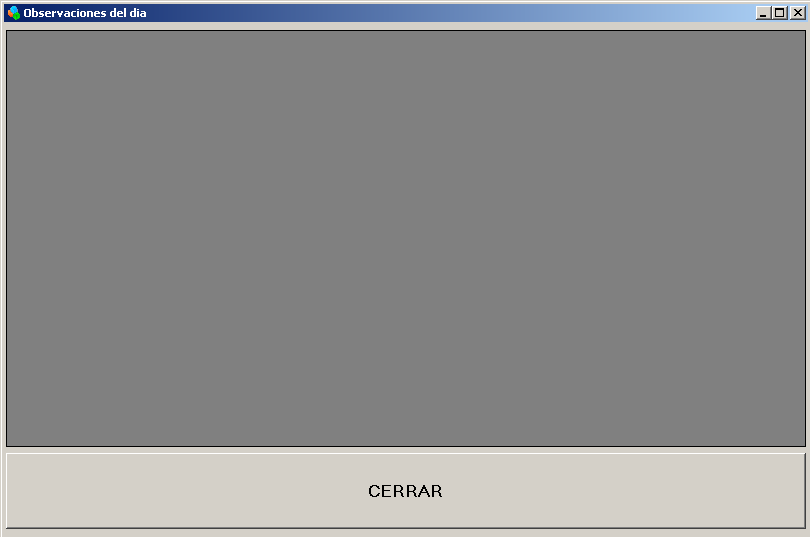
		
		
********************************
Copia de rótulos
********************************

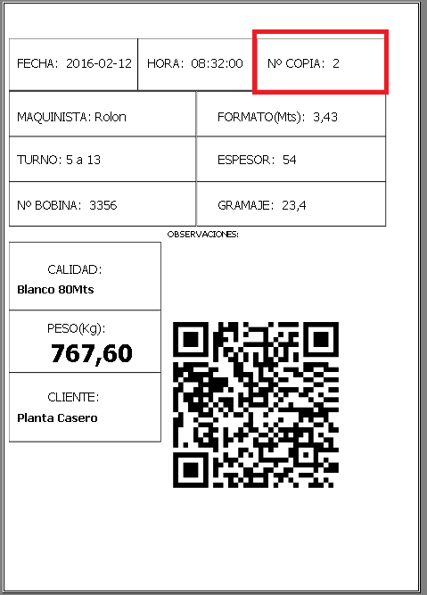

Como se puede ver en la imagen anterior, poseemos un rotulo de bobina cuyo número de copia es el 2. Las condiciones para que un rotulo sea considerado como copia es que entre ultima bobina que se haya y la siguiente que se vaya a agregar hayan pasado 600 segundos, es decir 10 minutos.

Por lo tanto para generar bobinas nuevas al sistema por lo menos deben haber pasado más de 10 minutos.

********************************
Configuracion balanza
********************************

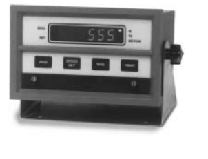

La balanza provista por el cliente, es una balanza electrónica con la capacidad de pesar bobinas de papel de hasta 1000kg. El modelo de la misma es UMC 555 GEA y fue vendida por CAIR SRL.
Una vez estudiado la hoja de datos del modelo de la balanza, se visitó al fabricante de dicha balanza, para confirmar las configuraciones apropiadas.

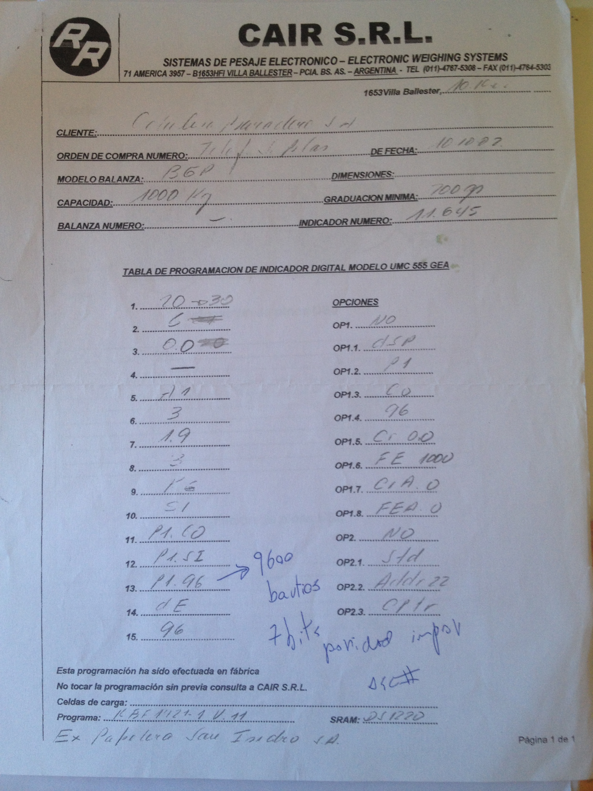

En la ilustración podemos observar la hoja de configuración entregada por el fabricante de balanzas electrónicas CAIR SRL, en donde allí detalla las configuraciones que deben aplicarse para la salida en puerto COM.
Configuración:

- 9600 bautios
- 7 bits de paridad impar

Además para la configuración de la PC a la balanza, hay que seleccionar el puerto COM1 para el puerto serie del adaptador. Para aplicar dicha configuración nos vamos a Propiedades Mi Pc/Equipo y seleccionamos administrador de dispositivos. Vamos a controlador de bus serie universal y seleccionamos el del adaptador haciéndole  click derecho al mismo.

Ahí mismo podremos seleccionar las configuraciones descriptas.

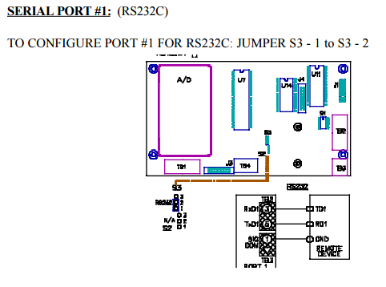

Como se puede observar en la ilustración anterior, se ve a grandes rasgos el circuito del cabezal digital que toma el peso de la balanza. Allí se indica cuáles son las borneras de Tx, Rx y GND para enviar por RS232 (DB9) la salida del peso de la misma.
Para llevarlo a la PC, lo que se hizo fue comprar un adaptador de DB9 a usb.
A nivel programación lo que se debió hacer es incluir una librería para C#, System.IO.Ports y poder recibir el dato transmitido en el puerto COM conectado.

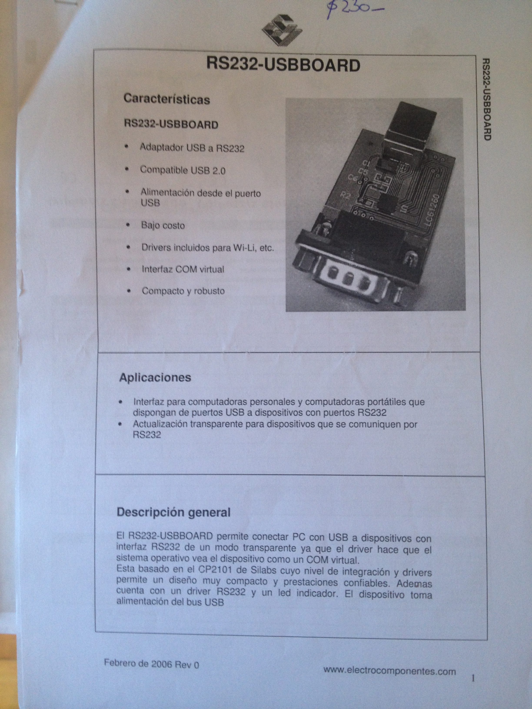

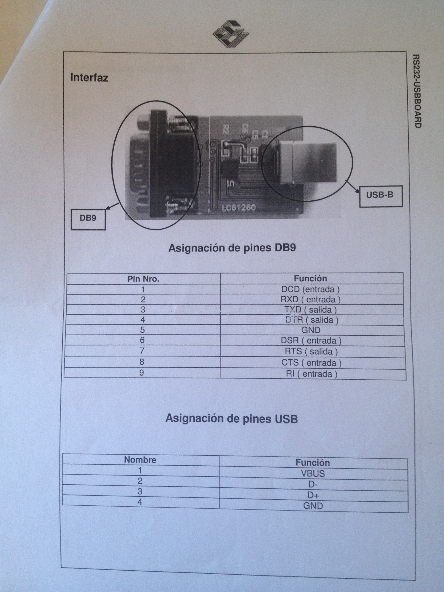

En la ilustración 3 se pueden observar cual fue el adaptador adquirido y cuáles son los pines del Tx,Rx y GND para conectar a las borneras de la balanza.

Los pines en un DB9 y las conexiones que deben hacerse para los Tx, Rx y GND son las siguientes:

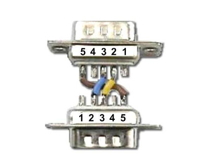

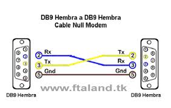

