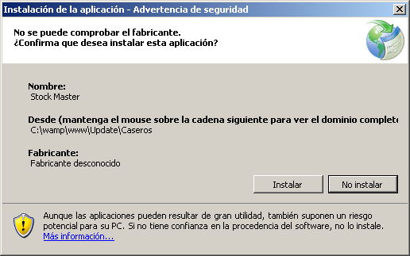
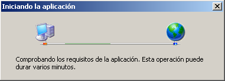

Instalacion
===========

**********************
Instalando el programa
**********************

Para comenzar la instalacion del programa, simplemente deberemos ejecutar el archivo ‘setup.exe’ que se encuentra en la carpeta de los archivos de instalación.

Una vez ejecutado el archivo nos aparecera la siguiente imagen:

Para comenzar la instalacion del programa simplemente deberemos dar click en ‘instalar’ y a continuacion ya tenemos el sistema instalado correctamente  en nuestro ordenador.

Para el ingreso de la aplicacion simplemente deberemos buscar el acceso directo creado por el instalador en nuestro escritorio

***************************
Actualizaciones automaticas
***************************

Las actualizaciones automaticas, tal como lo dice el nombre, se realizan y chequean una vez iniciada la aplicacion. Por lo tanto la aplicacion siempre estara actualizada y a la ultima version que se la haya desarrollado.

La imagen que aparece para el chequeo de actualizacion es el siguiente:

